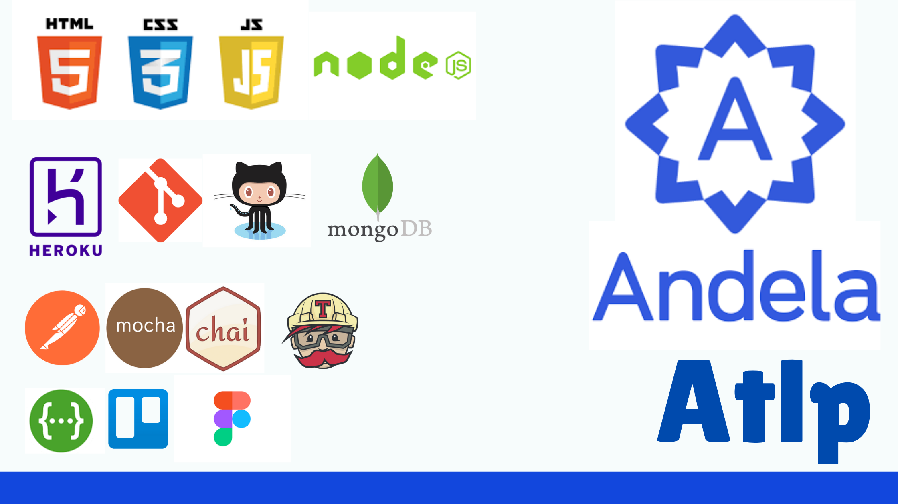

# Andela-atlp-resources

If you have graduated from Andela technical Leadership or you have just been accepted then you know how overwhelming it is at first without guidance. These resources are not here to encourange participants to engage in pragmatic behaviours but to save them time looking through useless links and guide them to resources that are beneficial for their journey in atlp and beyond.

These resources can be used for:
- Saving learners time :clock:
- Now and then sneak and picky for trainees.

## Table of Contents

  - [Core Concepts](#core-concepts)
    - [Module 1 | Creating UI](#creating-ui)
    - [Module 2 | Javascript and Data Structures](#javascript-and-data-structures)
    - [Module 3 | NodeJs and ExpressJS](#nodejs-and-expressjs)
    - [Module 4 | Integration](#integration)
  - [Team Projects ](#team-projects)
    - [Barefoot Nomad](#barefoot-nomad)
      - [Back-end](#backend)
      - [Front-end](#frontend)
    - [Phantom](#phantom)
      - [Backe-nd](#backend)
      - [Front-end](#frontend)
  - [Apprenticeship](#apprenticeship)

## Core Concepts

This will be your first step into your journey in atlp. There will be onboarding where the trainees will be briefed on the timeline of the program, the requirements

### Creating UI

This will be your first module to kick off your journey in atlp. You will be asked to utilize HTML, CSS and JavaScript to create UI templates for your blog. But that won't be all, you will also need to use the following tools:
- **Trello** : A project management tool.
- **Figma** : For creating mockups( The design for your UI).
- **GitHub** : For tracking your codes and static hosting.

### JavaScript and Data Structures.

During this second module the primary goal is to understand javascript better and how it can be used to manipulate DOM. You will also be required to use **LocalStorage** or **IndexDB** to store and retrive data.

### NodeJS and ExpressJS

At this stage, trainees will develop the backend of the blog(any other project) they have made the UI for in the earlier phases.

### Integration

Now that you've built the frontend and backend, it is time to join the two together and integrate both functionalities.

If you carried out the task of storing data in local storage in previous module, then this won't be hard as you will be making only minimal changes to store and retrieve from the api.

## Team Projects

To this point the trainee has finished the extensive and exhausting phase one of core concepts. But now comes the second phase of Team project. In this phase the learners will be assigned a project which they will have to collaborate on.

Good knowledge of github from previous will be very essential to thrive through this stage.

They will be divided into teams of between 5 to 10 to develop one these 2 projects.  
     
    1. Barefoot Nomad:
    2. Phantom

## Apprenticeship